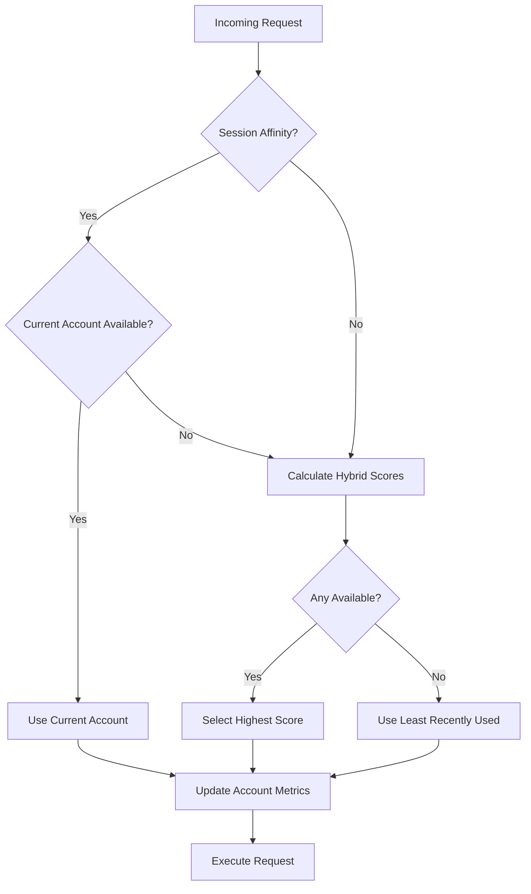

## Overview

**Account rotation** is the core mechanism that selects which account to use for each request. The system uses a **hybrid selection algorithm** that combines:

1. **Health scores** - Track success/failure patterns
2. **Token buckets** - Prevent preemptive rate limiting
3. **Freshness** - Distribute load across accounts
4. **Session affinity** - Maintain consistency within conversations

## Selection Algorithm

### Hybrid Scoring Formula

The account selection uses a weighted scoring system (`lib/rotation.ts:318-393`):

```typescript
Score = (health × 2) + (tokens × 5) + (hoursSinceUsed × 2)
```

**Weight breakdown:**
- **Health weight: 2** - Moderate preference for healthy accounts
- **Token weight: 5** - Strong preference for accounts with quota headroom
- **Freshness weight: 2** - Balanced load distribution

### Selection Flow



### Implementation

From `lib/rotation.ts:318-393`:

```typescript
export function selectHybridAccount(
  accounts: AccountWithMetrics[],
  healthTracker: HealthScoreTracker,
  tokenTracker: TokenBucketTracker,
  quotaKey?: string,
  config: Partial<HybridSelectionConfig> = {},
  options: HybridSelectionOptions = {}
): AccountWithMetrics | null {
  const cfg = { 
    healthWeight: 2,
    tokenWeight: 5,
    freshnessWeight: 2.0,
    ...config 
  };
  
  const available = accounts.filter(a => a.isAvailable);
  
  // Fallback: return least recently used if none available
  if (available.length === 0) {
    return accounts.reduce((oldest, curr) => 
      curr.lastUsed < oldest.lastUsed ? curr : oldest
    );
  }
  
  let bestAccount: AccountWithMetrics | null = null;
  let bestScore = -Infinity;
  
  for (const account of available) {
    const health = healthTracker.getScore(account.index, quotaKey);
    const tokens = tokenTracker.getTokens(account.index, quotaKey);
    const hoursSinceUsed = (Date.now() - account.lastUsed) / (1000 * 60 * 60);
    
    const score = 
      health * cfg.healthWeight +
      tokens * cfg.tokenWeight +
      hoursSinceUsed * cfg.freshnessWeight;
    
    if (score > bestScore) {
      bestScore = score;
      bestAccount = account;
    }
  }
  
  return bestAccount;
}
```

## Health Score Tracking

### Score Dynamics

Health scores range from **0-100** with passive recovery (`lib/rotation.ts:17-127`):

<CodeGroup>
```typescript Configuration
interface HealthScoreConfig {
  successDelta: number;           // +1 per success
  rateLimitDelta: number;         // -10 per rate limit
  failureDelta: number;           // -20 per failure
  maxScore: number;               // 100
  minScore: number;               // 0
  passiveRecoveryPerHour: number; // +2 per hour idle
}
```

```typescript Events
// Success: +1 point
healthTracker.recordSuccess(accountIndex, quotaKey);

// Rate limit: -10 points
healthTracker.recordRateLimit(accountIndex, quotaKey);

// Other failure: -20 points
healthTracker.recordFailure(accountIndex, quotaKey);
```
</CodeGroup>

### Passive Recovery

Unused accounts gradually recover health:

```typescript
private applyPassiveRecovery(entry: HealthEntry): number {
  const now = Date.now();
  const hoursSinceUpdate = (now - entry.lastUpdated) / (1000 * 60 * 60);
  const recovery = hoursSinceUpdate * this.config.passiveRecoveryPerHour;
  return Math.min(entry.score + recovery, this.config.maxScore);
}
```

**Example recovery timeline:**
- Account hits rate limit: health drops to **60** (-10)
- After 1 hour idle: health recovers to **62** (+2)
- After 10 hours idle: health fully recovers to **100**
- After 20 hours idle: capped at **100**

## Token Bucket Rate Limiting

### Client-Side Token Tracking

Prevent requests before server-side rate limits hit (`lib/rotation.ts:131-261`):

```typescript
interface TokenBucketConfig {
  maxTokens: number;        // 50 (max bucket capacity)
  tokensPerMinute: number;  // 6 (refill rate)
}
```

### Token Consumption

Each request consumes one token:

```typescript
tryConsume(accountIndex: number, quotaKey?: string): boolean {
  const currentTokens = this.refillTokens(entry);
  
  if (currentTokens < 1) {
    return false; // Bucket empty, account unavailable
  }
  
  this.buckets.set(key, {
    tokens: currentTokens - 1,
    lastRefill: Date.now(),
    consumptions: [...consumptions, Date.now()]
  });
  
  return true;
}
```

### Token Refills

Tokens automatically refill over time:

```typescript
private refillTokens(entry: TokenBucketEntry): number {
  const now = Date.now();
  const minutesSinceRefill = (now - entry.lastRefill) / (1000 * 60);
  const tokensToAdd = minutesSinceRefill * this.config.tokensPerMinute;
  return Math.min(entry.tokens + tokensToAdd, this.config.maxTokens);
}
```

**Example timeline:**
- Account starts: **50 tokens**
- After 10 requests: **40 tokens** remaining
- After 1 minute: **46 tokens** (40 + 6 refilled)
- After 10 minutes: **50 tokens** (capped at max)

### Token Refunds

Network errors (not rate limits) can refund tokens within **30 seconds**:

```typescript
refundToken(accountIndex: number, quotaKey?: string): boolean {
  const now = Date.now();
  const cutoff = now - 30_000; // 30 second window
  
  const validIndex = entry.consumptions.findIndex(
    timestamp => timestamp >= cutoff
  );
  
  if (validIndex === -1) return false;
  
  // Refund the token
  entry.consumptions.splice(validIndex, 1);
  entry.tokens = Math.min(entry.tokens + 1, maxTokens);
  return true;
}
```

## Failover Mechanisms

### Automatic Rotation Triggers

Accounts rotate automatically when:

<AccordionGroup>
  <Accordion title="Rate Limit (429)" icon="gauge-high">
    **Action:**
    - Mark account rate-limited with reset time
    - Drain token bucket (-10 tokens)
    - Reduce health score (-10 points)
    - Rotate to next available account
    
    **Recovery:**
    - Account becomes available after `Retry-After` expires
    - Tokens refill at 6/minute
    - Health recovers at 2/hour
  </Accordion>
  
  <Accordion title="Auth Failure (401/403)" icon="lock">
    **Action:**
    - Attempt token refresh
    - If refresh fails 3+ times: mark account for cooldown
    - Rotate to next account
    
    **Recovery:**
    - Manual re-authentication: `codex auth login`
    - Auto-retry after cooldown period
  </Accordion>
  
  <Accordion title="Server Error (5xx)" icon="server">
    **Action:**
    - Reduce health score (-20 points)
    - Rotate to next account
    - Do NOT refund token (server-side failure)
    
    **Recovery:**
    - Health recovers passively (2/hour)
    - Automatic retry after health improves
  </Accordion>
  
  <Accordion title="Network Error" icon="wifi-slash">
    **Action:**
    - Refund token if within 30s window
    - Reduce health score (-20 points)
    - Rotate to next account
    
    **Recovery:**
    - Immediate retry with different account
    - Token refunded, no quota impact
  </Accordion>
</AccordionGroup>

### Cooldown System

Accounts can be temporarily disabled (`lib/accounts.ts:565-583`):

```typescript
markAccountCoolingDown(
  account: ManagedAccount, 
  cooldownMs: number, 
  reason: CooldownReason
): void {
  account.coolingDownUntil = Date.now() + cooldownMs;
  account.cooldownReason = reason;
}

isAccountCoolingDown(account: ManagedAccount): boolean {
  if (!account.coolingDownUntil) return false;
  if (Date.now() >= account.coolingDownUntil) {
    this.clearAccountCooldown(account);
    return false;
  }
  return true;
}
```

**Cooldown reasons:**
- `auth_failure` - Multiple authentication failures
- `quota_exhausted` - Primary + secondary quota both exhausted
- `manual` - Manually disabled via `codex auth disable <index>`

## Availability Checks

### Account Availability

An account is available when ALL conditions are met:

```typescript
isAccountAvailableForFamily(
  index: number, 
  family: ModelFamily, 
  model?: string
): boolean {
  const account = this.getAccountByIndex(index);
  if (!account) return false;
  if (account.enabled === false) return false;
  
  clearExpiredRateLimits(account);
  
  return !isRateLimitedForFamily(account, family, model) && 
         !this.isAccountCoolingDown(account);
}
```

**Checks performed:**
1. Account exists
2. Account not manually disabled
3. No active rate limits for model family
4. Not in cooldown period

### Rate Limit Expiry

Expired rate limits are automatically cleared:

```typescript
export function clearExpiredRateLimits(account: ManagedAccount): void {
  const now = Date.now();
  for (const [key, resetAt] of Object.entries(account.rateLimitResetTimes)) {
    if (resetAt <= now) {
      delete account.rateLimitResetTimes[key];
    }
  }
}
```

## Monitoring and Diagnostics

### View Account Health

```bash
# Quick health check
codex auth check

# Detailed health with live quota probes
codex auth check --live

# Account forecast (next recommended account)
codex auth forecast

# Forecast with live quota data
codex auth forecast --live --model gpt-5-codex
```

### Health Dashboard

Run `codex auth` to see:

```
┌─────────────────────────────────────────────────────────────────┐
│ Account 1 (dev@example.com)                           [ACTIVE]  │
│ Health: ████████░░ 85/100    Tokens: ██████████ 42/50          │
│ Last used: 2m ago            Rate limits: none                  │
└─────────────────────────────────────────────────────────────────┘

┌─────────────────────────────────────────────────────────────────┐
│ Account 2 (staging@example.com)                                 │
│ Health: ████░░░░░░ 40/100    Tokens: ████░░░░░░ 18/50          │
│ Last used: 15m ago           Rate limits: 2h 45% left (14:30)  │
└─────────────────────────────────────────────────────────────────┘
```

## Configuration

### Tuning Rotation Behavior

Customize selection weights in your Codex config:

```json
{
  "multiAuth": {
    "rotation": {
      "healthWeight": 2.0,
      "tokenWeight": 5.0,
      "freshnessWeight": 2.0
    },
    "tokenBucket": {
      "maxTokens": 50,
      "tokensPerMinute": 6
    },
    "healthScore": {
      "successDelta": 1,
      "rateLimitDelta": -10,
      "failureDelta": -20,
      "passiveRecoveryPerHour": 2
    }
  }
}
```

<Tip>
Increase `tokenWeight` to more aggressively avoid accounts nearing rate limits. Increase `freshnessWeight` to distribute load more evenly.
</Tip>

## Related Concepts

<CardGroup cols={2}>
  <Card title="Quota Management" icon="gauge" href="/concepts/quota-management">
    Learn how quotas are tracked and prevent rate limits
  </Card>
  
  <Card title="Session Recovery" icon="arrow-rotate-left" href="/concepts/session-recovery">
    Understand session affinity and recovery
  </Card>
  
  <Card title="Multi-Account OAuth" icon="key" href="/concepts/multi-account-oauth">
    See how accounts are authenticated
  </Card>
  
  <Card title="Settings Reference" icon="sliders" href="/cli/settings-reference">
    View all configuration options
  </Card>
</CardGroup>