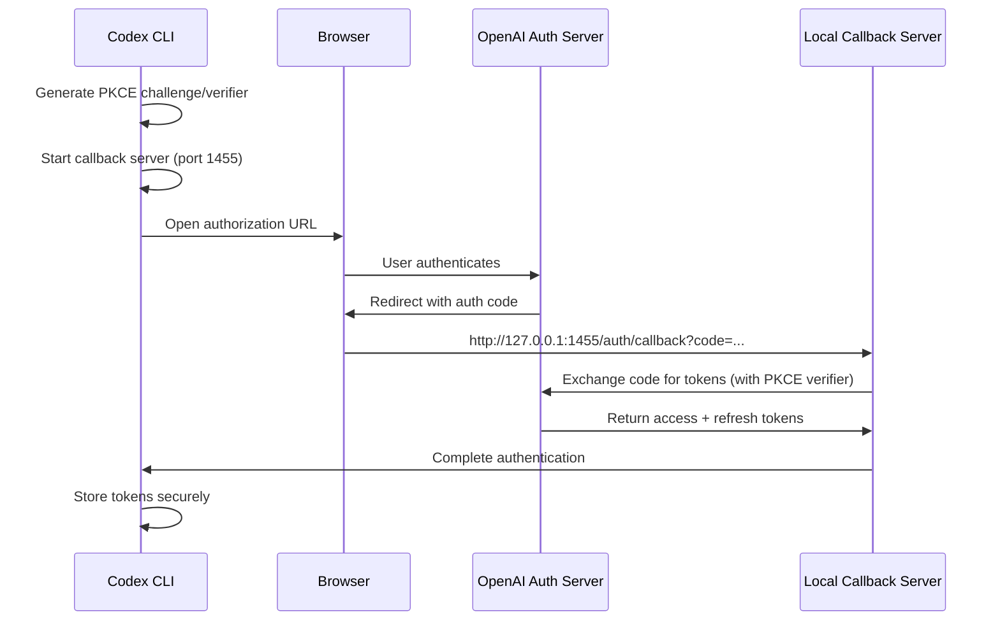

## Overview

Codex Multi-Auth implements a **multi-account OAuth system** that allows you to authenticate and manage multiple OpenAI accounts simultaneously. This enables seamless account rotation, load distribution, and quota management across your team's accounts.

## OAuth Flow Architecture

### PKCE (Proof Key for Code Exchange)

The plugin uses **PKCE** (RFC 7636) for secure OAuth authentication without client secrets:



### PKCE Implementation

The PKCE flow is implemented in `lib/auth/auth.ts:220-243`:

```typescript
export async function createAuthorizationFlow(
  options?: AuthorizationFlowOptions
): Promise<AuthorizationFlow> {
  const pkce = await generatePKCE(); // S256 challenge
  const state = createState();       // Random nonce

  const url = new URL(AUTHORIZE_URL);
  url.searchParams.set('code_challenge', pkce.challenge);
  url.searchParams.set('code_challenge_method', 'S256');
  url.searchParams.set('state', state);
  
  // Force fresh login when adding multiple accounts
  if (options?.forceNewLogin) {
    url.searchParams.set('prompt', 'login');
  }

  return { pkce, state, url: url.toString() };
}
```

**Key security features:**
- **S256 hashing** of code verifier prevents interception attacks
- **State parameter** prevents CSRF attacks
- **Local callback server** (127.0.0.1:1455) keeps tokens on your machine
- **No client secret** required or stored

## Token Management

### Token Structure

Each authenticated account stores:

<CodeGroup>
```typescript Account Storage
interface ManagedAccount {
  index: number;
  accountId?: string;        // Extracted from JWT
  email?: string;            // Extracted from JWT
  refreshToken: string;      // Long-lived refresh token
  access?: string;           // Short-lived access token
  expires?: number;          // Access token expiry (ms)
  enabled?: boolean;         // Account enabled state
  addedAt: number;           // First added timestamp
  lastUsed: number;          // Last request timestamp
  rateLimitResetTimes: Record<string, number>;
  coolingDownUntil?: number;
}
```

```json Example Storage
{
  "version": 3,
  "accounts": [
    {
      "accountId": "user-abc123",
      "email": "dev@example.com",
      "refreshToken": "<encrypted>",
      "accessToken": "<encrypted>",
      "expiresAt": 1709481234567,
      "enabled": true,
      "addedAt": 1709395234567,
      "lastUsed": 1709480000000,
      "rateLimitResetTimes": {}
    }
  ],
  "activeIndex": 0
}
```
</CodeGroup>

### JWT Decoding

Account identity is extracted from JWT tokens (`lib/auth/auth.ts:139-154`):

```typescript
export function decodeJWT(token: string): JWTPayload | null {
  try {
    const parts = token.split('.');
    if (parts.length !== 3) return null;
    
    const payload = parts[1];
    const normalized = payload.replace(/-/g, '+').replace(/_/g, '/');
    const padded = normalized.padEnd(
      normalized.length + ((4 - (normalized.length % 4)) % 4),
      '='
    );
    const decoded = Buffer.from(padded, 'base64').toString('utf-8');
    return JSON.parse(decoded);
  } catch {
    return null;
  }
}
```

Extracted fields include:
- `sub` → `accountId`
- `email` → `email`
- `exp` → token expiry validation

## Token Refresh

### Automatic Refresh

Access tokens are automatically refreshed before expiry using the **refresh queue** to prevent race conditions:

```typescript
export async function refreshAccessToken(
  refreshToken: string
): Promise<TokenResult> {
  const response = await fetch(TOKEN_URL, {
    method: 'POST',
    headers: { 'Content-Type': 'application/x-www-form-urlencoded' },
    body: new URLSearchParams({
      grant_type: 'refresh_token',
      refresh_token: refreshToken,
      client_id: CLIENT_ID,
    }),
  });

  if (!response.ok) {
    return { 
      type: 'failed', 
      reason: 'http_error', 
      statusCode: response.status 
    };
  }

  const json = await response.json();
  return {
    type: 'success',
    access: json.access_token,
    refresh: json.refresh_token ?? refreshToken,
    expires: Date.now() + json.expires_in * 1000,
  };
}
```

### Refresh Guardian

The **Proactive Refresh Guardian** (`lib/proactive-refresh.ts`) refreshes tokens before they expire:

- Refreshes when **< 5 minutes** remaining
- Uses **refresh lease** to prevent concurrent refreshes
- Falls back to on-demand refresh if proactive refresh fails

## Multi-Account Management

### Adding Accounts

Add multiple accounts using:

```bash
# Add first account
codex auth login

# Add additional accounts (forces fresh login)
codex auth login --force-new-login
```

The `--force-new-login` flag sets `prompt=login` to prevent browser session reuse.

### Account Deduplication

Accounts are deduplicated by:
1. **Refresh token** (exact match)
2. **Account ID** (from JWT)
3. **Email** (case-insensitive, normalized)

```typescript
function normalizeEmailKey(email: string | undefined): string | null {
  if (!email) return null;
  return email.trim().toLowerCase();
}
```

### Storage Locations

<Tabs>
  <Tab title="Project-Scoped">
    ```
    ~/.codex/multi-auth/projects/<project-key>/openai-codex-accounts.json
    ```
    
    Automatically detected by walking up from current directory to find:
    - `.git` directory
    - `package.json`
    - Other project markers
  </Tab>
  
  <Tab title="Global Fallback">
    ```
    ~/.codex/multi-auth/openai-codex-accounts.json
    ```
    
    Used when no project root is detected.
  </Tab>
</Tabs>

## Security Considerations

<Warning>
Tokens are stored in plain JSON files. Ensure proper file permissions:
- **Unix/Linux/macOS:** `chmod 600` (owner read/write only)
- **Windows:** ACL restricts to current user
</Warning>

### Token Redaction

Sensitive parameters are automatically redacted in logs:

```typescript
const OAUTH_SENSITIVE_QUERY_PARAMS = [
  'state',
  'code', 
  'code_challenge',
  'code_verifier',
];

export function redactOAuthUrlForLog(rawUrl: string): string {
  const parsed = new URL(rawUrl);
  for (const key of OAUTH_SENSITIVE_QUERY_PARAMS) {
    if (parsed.searchParams.has(key)) {
      parsed.searchParams.set(key, '<redacted>');
    }
  }
  return parsed.toString();
}
```

## OAuth Configuration

The plugin uses these OAuth constants (`lib/auth/auth.ts:7-12`):

```typescript
export const CLIENT_ID = "app_EMoamEEZ73f0CkXaXp7hrann";
export const AUTHORIZE_URL = "https://auth.openai.com/oauth/authorize";
export const TOKEN_URL = "https://auth.openai.com/oauth/token";
export const REDIRECT_URI = "http://127.0.0.1:1455/auth/callback";
export const SCOPE = "openid profile email offline_access";
```

**Scope breakdown:**
- `openid` - OpenID Connect authentication
- `profile` - User profile information
- `email` - User email address
- `offline_access` - Refresh token grant

## Related Concepts

<CardGroup cols={2}>
  <Card title="Account Rotation" icon="arrows-rotate" href="/concepts/account-rotation">
    Learn how accounts are selected and rotated based on health scores
  </Card>
  
  <Card title="Session Affinity" icon="link" href="/concepts/session-recovery">
    Understand how sessions stick to specific accounts
  </Card>
  
  <Card title="Quota Management" icon="gauge" href="/concepts/quota-management">
    See how quotas are tracked and managed per account
  </Card>
  
  <Card title="Commands Reference" icon="terminal" href="/cli/overview">
    View all available CLI commands
  </Card>
</CardGroup>