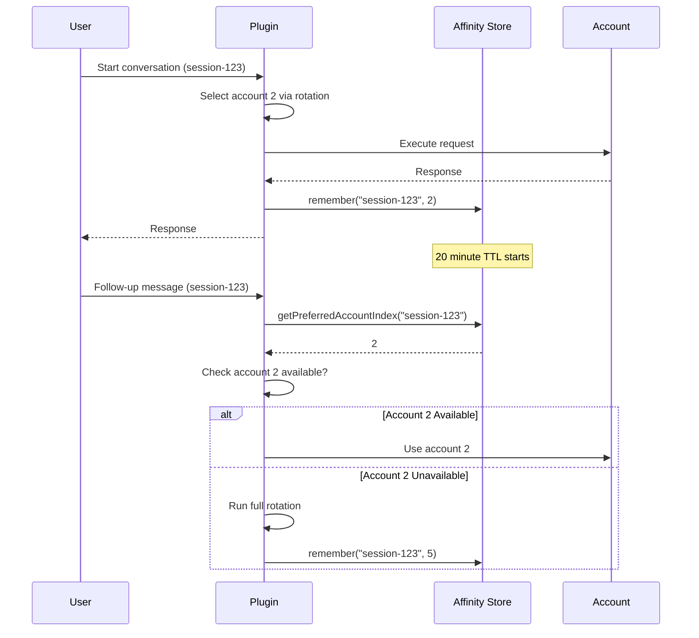
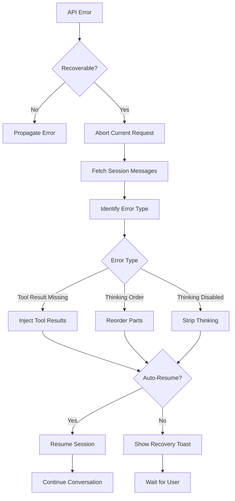

## Overview

**Session recovery** ensures continuity across conversation turns and recovers from API errors that would otherwise break your workflow. The system provides:

1. **Session affinity** - Keep conversations on the same account
2. **Automatic error recovery** - Fix common API validation errors
3. **State persistence** - Track conversation state for recovery
4. **Graceful failover** - Switch accounts when necessary

## Session Affinity

### Concept

**Session affinity** ensures that follow-up messages in a conversation use the same account, maintaining:
- Consistent rate limit tracking
- Conversation context continuity  
- Reduced account thrashing
- Better debugging experience

### Implementation

From `lib/session-affinity.ts:40-144`:

```typescript
class SessionAffinityStore {
  private readonly ttlMs: number = 20 * 60 * 1000; // 20 minutes
  private readonly maxEntries: number = 512;
  private readonly entries = new Map<string, SessionAffinityEntry>();
  
  getPreferredAccountIndex(
    sessionKey: string, 
    now = Date.now()
  ): number | null {
    const entry = this.entries.get(sessionKey);
    if (!entry) return null;
    
    // Expire stale affinity
    if (entry.expiresAt <= now) {
      this.entries.delete(sessionKey);
      return null;
    }
    
    return entry.accountIndex;
  }
  
  remember(
    sessionKey: string, 
    accountIndex: number, 
    now = Date.now()
  ): void {
    // Evict oldest if at capacity
    if (this.entries.size >= this.maxEntries && !this.entries.has(sessionKey)) {
      const oldest = this.findOldestKey();
      if (oldest) this.entries.delete(oldest);
    }
    
    this.entries.set(sessionKey, {
      accountIndex,
      expiresAt: now + this.ttlMs,
      updatedAt: now
    });
  }
}
```

### Affinity Lifecycle



### Affinity Parameters

<ParamField path="ttlMs" type="number" default="1200000">
  Time-to-live for affinity entries (default: 20 minutes)
  
  After this period, affinity expires and rotation algorithm runs fresh.
</ParamField>

<ParamField path="maxEntries" type="number" default="512">
  Maximum number of session affinity entries to track
  
  Oldest entries are evicted when limit is reached (LRU eviction).
</ParamField>

<ParamField path="sessionKey" type="string">
  Unique identifier for the conversation session
  
  Typically the session ID from the Codex platform. Normalized to max 256 characters.
</ParamField>

### Affinity Breaking Conditions

Affinity is broken (new account selected) when:

1. **Account becomes unavailable**
   - Rate limited
   - In cooldown period
   - Manually disabled
   - Authentication failure

2. **Affinity expires**
   - 20 minutes since last use
   - Session explicitly forgotten

3. **Account removed**
   - Account deleted from pool
   - All sessions reindexed

### Managing Affinity

```typescript
// Forget specific session
affinityStore.forgetSession("session-123");

// Forget all sessions for an account
affinityStore.forgetAccount(accountIndex);

// Prune expired entries
const removed = affinityStore.prune();

// Reindex after account removal
affinityStore.reindexAfterRemoval(removedAccountIndex);
```

## Error Recovery

### Recoverable Error Types

The system automatically recovers from these API validation errors (`lib/recovery.ts:62-84`):

<AccordionGroup>
  <Accordion title="Tool Result Missing" icon="tools">
    **Error:** API expects `tool_result` for a `tool_use` but conversation was interrupted
    
    **Recovery:**
    1. Detect missing tool results from last assistant message
    2. Inject synthetic `tool_result` parts with cancellation message
    3. Resume conversation automatically
    
    ```typescript
    // Injected tool result
    {
      type: 'tool_result',
      tool_use_id: 'toolu_abc123',
      content: 'Operation cancelled by user (ESC pressed)'
    }
    ```
  </Accordion>
  
  <Accordion title="Thinking Block Order" icon="brain">
    **Error:** API requires thinking blocks before other content but order is wrong
    
    **Recovery:**
    1. Find messages with orphaned thinking content
    2. Reorder parts to place thinking blocks first
    3. Auto-resume with corrected message structure
    
    ```typescript
    // Before: [text, thinking]
    // After:  [thinking, text]
    ```
  </Accordion>
  
  <Accordion title="Thinking Disabled Violation" icon="circle-xmark">
    **Error:** Thinking blocks present but thinking mode is disabled
    
    **Recovery:**
    1. Find all messages with thinking blocks
    2. Strip thinking parts from messages
    3. Auto-resume with sanitized messages
    
    ```typescript
    // Before: [thinking, text, thinking]
    // After:  [text]
    ```
  </Accordion>
</AccordionGroup>

### Recovery Flow



### Recovery Implementation

From `lib/recovery.ts:318-418`:

```typescript
const handleSessionRecovery = async (
  info: MessageInfo
): Promise<boolean> => {
  if (!info || info.role !== 'assistant' || !info.error) return false;
  
  const errorType = detectErrorType(info.error);
  if (!errorType) return false;
  
  const sessionID = info.sessionID;
  if (!sessionID) return false;
  
  // Abort current request
  if (onAbortCallback) onAbortCallback(sessionID);
  await client.session.abort({ path: { id: sessionID } });
  
  // Fetch full session state
  const messagesResp = await client.session.messages({
    path: { id: sessionID },
    query: { directory }
  });
  const msgs = messagesResp.data;
  
  // Find failed assistant message
  const failedMsg = msgs?.find(m => m.info?.id === info.id);
  if (!failedMsg) return false;
  
  // Show recovery toast
  const toastContent = getRecoveryToastContent(errorType);
  await client.tui.showToast({
    body: {
      title: toastContent.title,
      message: toastContent.message,
      variant: 'warning'
    }
  });
  
  // Execute recovery based on error type
  let success = false;
  if (errorType === 'tool_result_missing') {
    success = await recoverToolResultMissing(client, sessionID, failedMsg);
  } else if (errorType === 'thinking_block_order') {
    success = recoverThinkingBlockOrder(sessionID, failedMsg, info.error);
    if (success && config.autoResume) {
      const lastUser = findLastUserMessage(msgs);
      await resumeSession(client, lastUser, sessionID, directory);
    }
  } else if (errorType === 'thinking_disabled_violation') {
    success = recoverThinkingDisabledViolation(sessionID, failedMsg);
    if (success && config.autoResume) {
      const lastUser = findLastUserMessage(msgs);
      await resumeSession(client, lastUser, sessionID, directory);
    }
  }
  
  return success;
};
```

## State Persistence

### Conversation State Storage

Message parts are persisted for recovery (`lib/recovery/storage.ts`):

```typescript
export function saveParts(
  messageID: string, 
  parts: MessagePart[]
): boolean {
  const stateDir = getRecoveryStateDir();
  const filePath = path.join(stateDir, `${messageID}.json`);
  
  try {
    fs.writeFileSync(filePath, JSON.stringify({
      messageID,
      savedAt: Date.now(),
      parts
    }));
    return true;
  } catch {
    return false;
  }
}

export function readParts(messageID: string): MessagePart[] {
  const stateDir = getRecoveryStateDir();
  const filePath = path.join(stateDir, `${messageID}.json`);
  
  try {
    const raw = fs.readFileSync(filePath, 'utf-8');
    const data = JSON.parse(raw);
    return data.parts ?? [];
  } catch {
    return [];
  }
}
```

**Storage location:**
```
~/.codex/multi-auth/recovery/<session-id>/<message-id>.json
```

### State Cleanup

Old recovery state is automatically pruned:

```typescript
export function pruneOldRecoveryState(maxAgeMs: number = 86400000): number {
  const stateDir = getRecoveryStateDir();
  const cutoff = Date.now() - maxAgeMs;
  let removed = 0;
  
  for (const file of fs.readdirSync(stateDir)) {
    const filePath = path.join(stateDir, file);
    const stat = fs.statSync(filePath);
    
    if (stat.mtimeMs < cutoff) {
      fs.unlinkSync(filePath);
      removed++;
    }
  }
  
  return removed;
}
```

Default: prune files older than **24 hours**

## Recovery Configuration

### Enable Recovery

Configure in your Codex config:

```json
{
  "multiAuth": {
    "sessionRecovery": true,
    "autoResume": true,
    "sessionAffinity": {
      "enabled": true,
      "ttlMs": 1200000,
      "maxEntries": 512
    }
  }
}
```

<ParamField path="sessionRecovery" type="boolean" default="true">
  Enable automatic session recovery from API validation errors
</ParamField>

<ParamField path="autoResume" type="boolean" default="true">
  Automatically resume conversation after successful recovery (sends "[session recovered - continuing previous task]")
</ParamField>

<ParamField path="sessionAffinity.enabled" type="boolean" default="true">
  Enable session affinity to keep conversations on same account
</ParamField>

<ParamField path="sessionAffinity.ttlMs" type="number" default="1200000">
  How long to maintain affinity (milliseconds)
</ParamField>

<ParamField path="sessionAffinity.maxEntries" type="number" default="512">
  Maximum concurrent sessions to track
</ParamField>

## Recovery Toasts

Users see informative toasts during recovery:

```typescript
const TOAST_CONTENT = {
  tool_result_missing: {
    title: 'Tool Crash Recovery',
    message: 'Injecting cancelled tool results...'
  },
  thinking_block_order: {
    title: 'Thinking Block Recovery',
    message: 'Fixing message structure...'
  },
  thinking_disabled_violation: {
    title: 'Thinking Strip Recovery',
    message: 'Stripping thinking blocks...'
  }
};
```

**Success toast:**
```
✓ Session Recovered
  Continuing where you left off...
```

**Failure toast:**
```
✗ Recovery Failed
  Please retry or start a new session.
```

## Advanced Recovery

### Custom Recovery Hooks

Register custom recovery logic:

```typescript
import { createSessionRecoveryHook } from './lib/recovery';

const recoveryHook = createSessionRecoveryHook(
  { client, directory },
  config
);

// Set abort callback
recoveryHook.setOnAbortCallback((sessionID) => {
  console.log(`Aborting session ${sessionID}`);
  // Custom cleanup logic
});

// Set completion callback  
recoveryHook.setOnRecoveryCompleteCallback((sessionID) => {
  console.log(`Recovery complete for ${sessionID}`);
  // Custom post-recovery logic
});

// Use in error handler
try {
  await executeRequest();
} catch (error) {
  if (recoveryHook.isRecoverableError(error)) {
    const recovered = await recoveryHook.handleSessionRecovery(messageInfo);
    if (recovered) {
      return; // Recovery successful
    }
  }
  throw error; // Propagate unrecoverable errors
}
```

### Manual Recovery

Force recovery from CLI:

```bash
# Diagnose session issues
codex auth doctor

# Fix common issues automatically
codex auth fix

# Check recovery state
ls ~/.codex/multi-auth/recovery/
```

## Monitoring

### Session Affinity Stats

```typescript
// Get current affinity size
const count = affinityStore.size();

// Prune expired and count removed
const pruned = affinityStore.prune();

// Check specific session
const accountIndex = affinityStore.getPreferredAccountIndex(sessionID);
if (accountIndex !== null) {
  console.log(`Session ${sessionID} pinned to account ${accountIndex}`);
}
```

### Recovery Metrics

Track recovery success in logs:

```typescript
log.debug('Recovery attempt started', {
  errorType,
  sessionID,
  messageID
});

if (success) {
  log.info('Session recovered successfully', {
    errorType,
    sessionID,
    autoResumed: config.autoResume
  });
} else {
  log.error('Recovery failed', {
    errorType,
    sessionID,
    error: String(err)
  });
}
```

## Best Practices

<CardGroup cols={2}>
  <Card title="Keep Affinity Enabled" icon="link">
    Session affinity reduces account switching and improves conversation consistency. Only disable for testing.
  </Card>
  
  <Card title="Enable Auto-Resume" icon="play">
    Auto-resume provides the smoothest UX after recovery. Disable only if you want manual control.
  </Card>
  
  <Card title="Monitor Recovery State" icon="folder">
    Periodically check `~/.codex/multi-auth/recovery/` size. Large directories indicate frequent errors.
  </Card>
  
  <Card title="Use Doctor Command" icon="stethoscope">
    Run `codex auth doctor` if you experience frequent recovery attempts. It diagnoses account health issues.
  </Card>
</CardGroup>

## Related Concepts

<CardGroup cols={2}>
  <Card title="Account Rotation" icon="arrows-rotate" href="/concepts/account-rotation">
    Learn how accounts are selected when affinity breaks
  </Card>
  
  <Card title="Multi-Account OAuth" icon="key" href="/concepts/multi-account-oauth">
    Understand account authentication and management
  </Card>
  
  <Card title="Quota Management" icon="gauge" href="/concepts/quota-management">
    See how quotas influence affinity breaking
  </Card>
  
  <Card title="Commands Reference" icon="terminal" href="/cli/overview">
    View all session and recovery commands
  </Card>
</CardGroup>